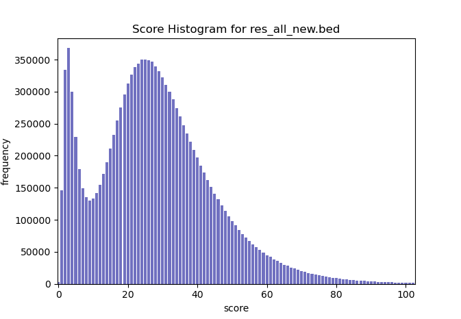

# molemap
Molemap maps linked- and long-read sequences to a linear reference genome. 

Individual long-reads are swiftly mapped without providing base pair precision. The mapping is multiple times faster than established long read mappers like minimap2, blend or BWA-MEM. Molemap returns mapped long reads in the [SAM](https://samtools.github.io/hts-specs/SAMv1.pdf) format. 

Linked reads are mapped on the barcode level. Molemap maps all reads that share the same barcode in unity and returns a mapping file in bed format. When working on uncompressed files, a barcode index is constructed alongside the mapping which can be used to quickly retrieve all reads belonging to any given barcode. For ease of use we provide a snakemake [workflow](https://github.com/kehrlab/molemap/tree/master/workflow) to extract all reads from user defined regions of interest.

Molemap leverages minimizers and hash tables to achieve ultra fast, memory efficient and reliable mapping of long sequence molecules. The low computational requirements of molemap allow the analysis of whole genome sequencing data of the human genome on basic hardware like a laptop. 

## Prerequisites
- gcc version 7.2.0

# Installation
Execute the following command.

    git clone https://github.com/kehrlab/molemap.git && cd molemap && make

The executable 'molemap' will be created locally in the cloned repository.

# Data requirements

## Long-reads
- Long-reads in fastq format (can be gzip compressed) 
- Tested on long-reads and HiFi-reads by PacBio and Oxford Nanopore.

## Linked-reads
- Paired-end Linked-reads in fastq format (can be gzip compressed)
- Barcodes are stored in BX:Z: flag of read Ids
- Sorted by barcode (use i.e. [bcctools](https://github.com/kehrlab/bcctools) (only for 10x genomics linked-reads) or [samtools](https://github.com/samtools/samtools))
- Tested on linked reads by 10x Genomics, STLfr and TellSeq
  
To trimm, correct and sort barcodes with bcctools use the following command in the bcctools folder:

    ./script/run_bcctools -f fastq <first.fq.gz> <second.fq.gz>

# Commands
For detailed information on Arguments and Options:

    ./molemap [command] --help

## index
Builds a minimized open addressing k-mer index of the reference genome. Linked- and long-reads require indexes with different characteristics, use the --preset option to choose the desired data type

    ./molemap index <reference.fa> --preset [linked/long] [options]

## mapLong

    ./molemap maplong <readfile.fq> [options]

## mapLinked
Maps the barcodes of the provided readfiles to the reference and creates a barcode index of the readfiles to quickly retrieve all reads of a given barcode.

    ./molemap maplinked <readfile1.fastq> <readfile2.fastq> [options]

Content of output bed-file:
* *chromosome  startposition  endposition  barcode  mapping_score*

Molemap returns a _output.hist_ file that can be ploted using _plot_score_histogram.py_ resulting in a plot like the one above. To create a set of mappings with very high precision (at the cost of some recall), the local minimum inbetween the two peaks should be set as the score threshold. A lower theshold yields better recall at the cost of precision, a higher threshold is not recomended.

## get
Returns all reads of the given barcodes. Barcodes can be provided directly as argument or in a file.

    ./molemap get <readfile1.fastq> <readfile2.fastq> <Barcodes.txt> [options]
 
# Example 
This small example demonstrates how to use molemap and allows you to check if it is properly installed. Navigate to the molemap folder and run the commands listed below.  

    # building the index for chr21.fa
    ./molemap index example/chr21.fa -o example/Index
    
    # mapping the reads of readfile 1 and 2 to chromosome 21
    ./molemap map example/readfile.1.fq example/readfile.2.fq -i example/Index -r example/ReadIndex -o example/results.bed
    
    # extracting the first barcode from the results
    awk '{if(NR==1) print($4)}' example/results.bed > example/FirstBarcode.txt
    
    # extracting all reads belonging to the first barcode
    ./molemap get example/readfile.1.fq example/readfile.2.fq example/FirstBarcode.txt -r example/ReadIndex -o example/readsOfFirstBarcode
    
    # extracting reads of barcode AACATCGCAAACAGTA
    ./molemap get example/readfile.1.fq example/readfile.2.fq AACATCGCAAACAGTA -r example/ReadIndex -o example/readsOfAACATCGCAAACAGTA

